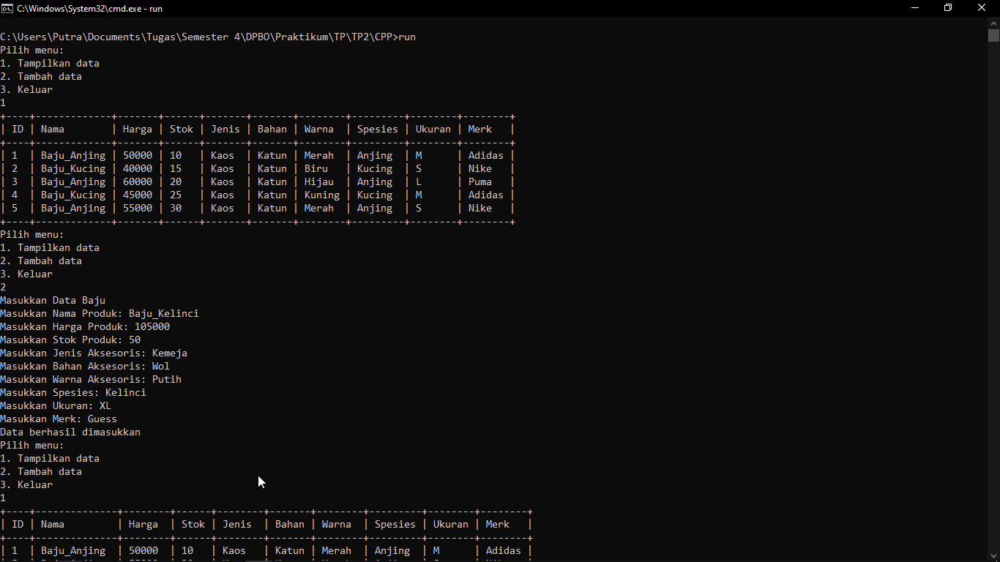
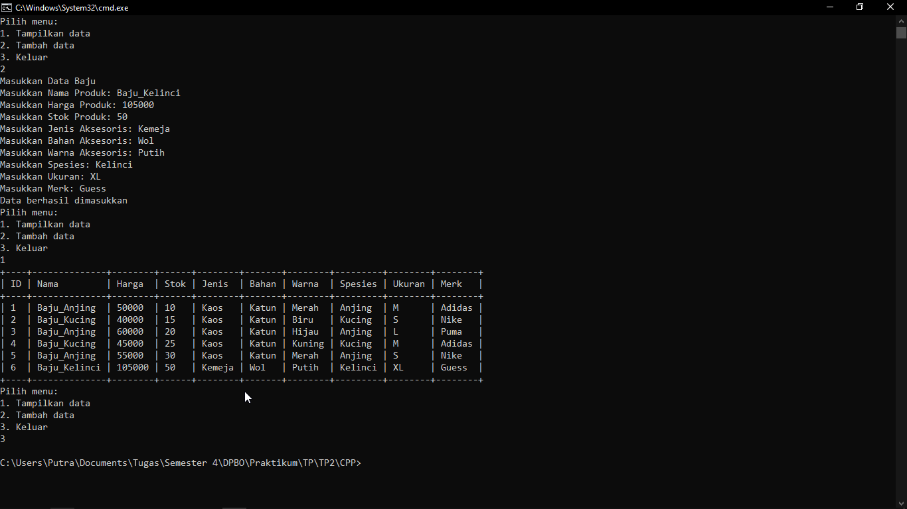
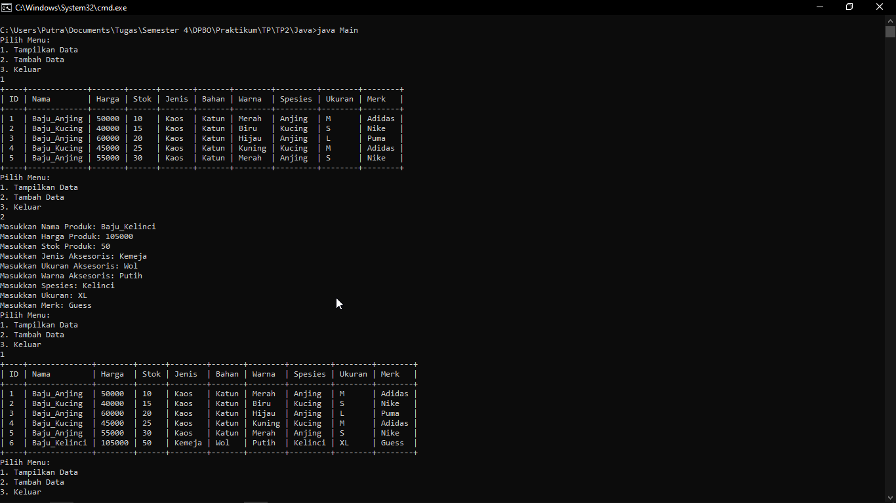
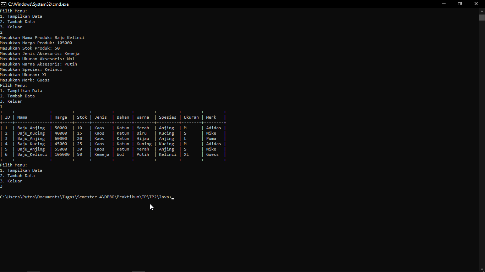
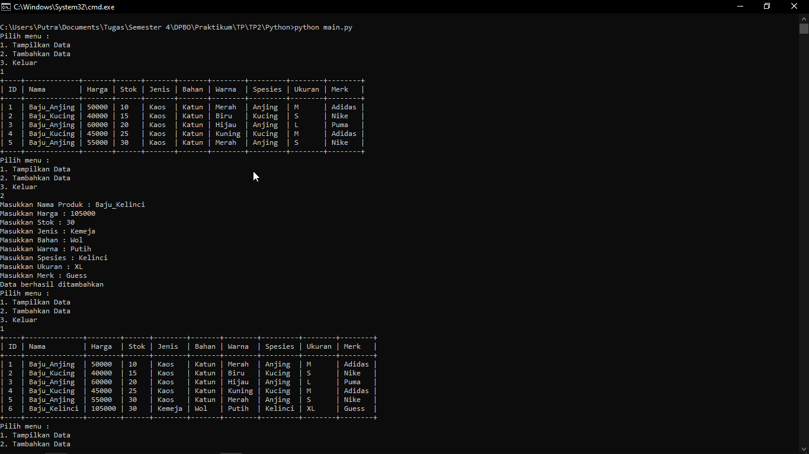
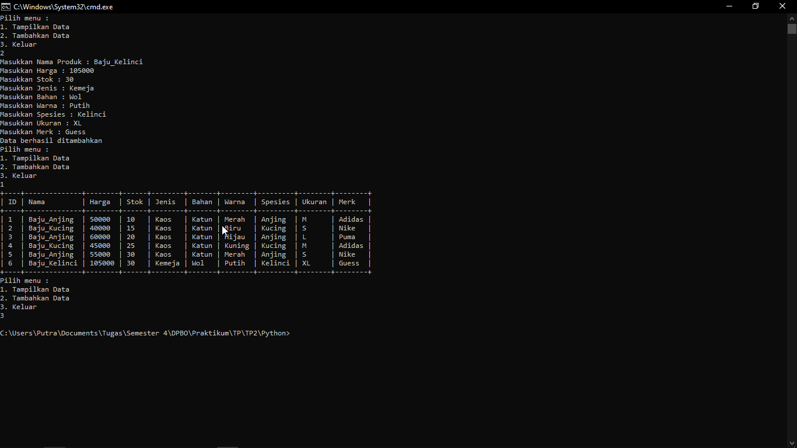
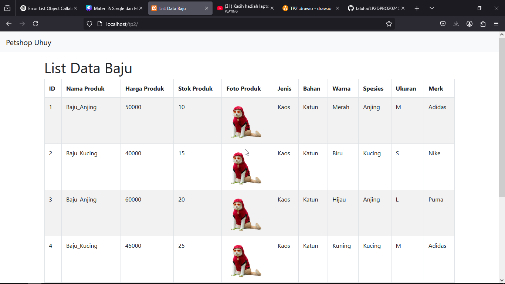
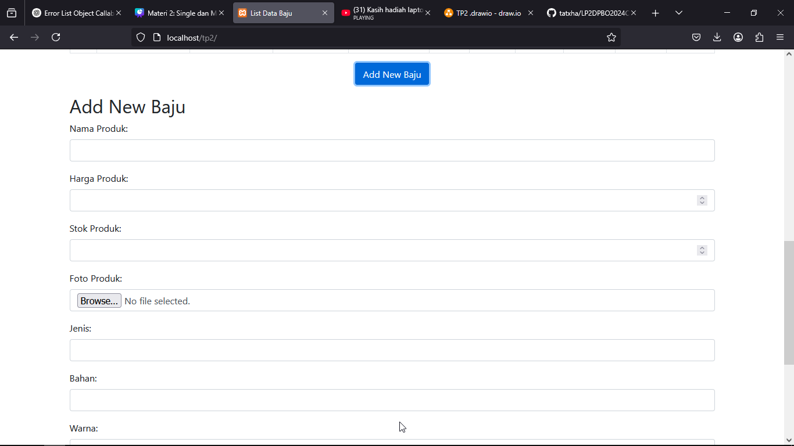
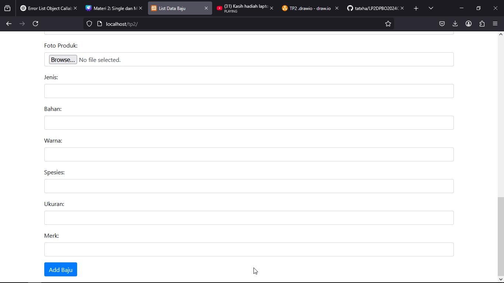

# Janji
*Saya Putra Hadiyanto Nugroho dengan NIM 2308163 mengerjakan soal Tugas Praktikum 2 dalam mata kuliah Desain Pemrograman Berorientasi Objek untuk keberkahanNya maka saya tidak melakukan kecurangan seperti yang telah dispesifikasikan. Aamiin.*

# Diagram

# Desain Program
Di dalam program terdapat 3 kelas, **Petshop, Aksesoris, dan Baju.** Petshop berupa class untuk item yang ada di Petshop, Aksesoris berupa class untuk Aksesoris yang ada di Petshop, dan Baju berupa class untuk Baju Hewan di Petshop. Oleh karena itu, terbentuk relasi Aksesoris child dari Petshop (Aksesoris subset dari Item Petshop) dan Baju merupakan child dari Aksesoris (Baju subset dari Akseris yang ada di Petshop).

Di dalam program terdapat pilihan untuk **add** data atau **view** data. Akan tetapi, di dalam main sudah ada 5 data yang diisi manual. Data disajikan dalam bentuk tabel dinamis. Khusus untuk **php** terdapat atribut untuk menyimpan foto. Berikut penjelasan untuk tiap Class.

## Petshop
Di dalam class **Petshop**, terdapat atribut sebagai berikut : 
1. **id**, integer dan otomatis diisi oleh program secara sequential
2. **nama_produk**, string menyimpan nama produk
3. **harga_produk**, integer menyimpan harga produk
4. **stok_produk**, integer menyimpan stok produk
5. **foto_produk**, khusus php menyimpan foto produk

Di dalam class Petshop, terdapat method getter dan setter untuk setiap atribut. Selain itu terdapat method untuk menghitung length dari setiap atribut.

## Aksesoris
Kelas **Aksesoris** merupakan child dari **Petshop**. Di dalam class **Aksesoris** terdapat atribut : 
1. **Jenis**, string menyimpan jenis aksesoris
2. **Bahan**, string menyimpan bahan dari aksesoris
3. **Warna**, string menyimpan warna dari aksesoris
   
Di dalam class Aksesoris, terdapat method getter dan setter untuk setiap atribut. Selain itu terdapat method untuk menghitung length dari setiap atribut.

## Baju
Kelas **Baju** merupakan child dari **Aksesoris**. Di dalam class **Baju** terdapat atribut :
1. **Spesies**, string menyimpan baju ini untuk spesies apa.
2. **Ukuran**, string menyimpan ukuran baju
3. **Merk**, string menyimpan merk dari baju
   
Di dalam class Baju, terdapat method getter dan setter untuk setiap atribut. Selain itu terdapat method untuk menghitung length dari setiap atribut.

# Dokumentasi Program
Untuk **Java, C++, dan Python** alur program sama persis. Data disimpan dalam bentuk **list/array** of objects **Baju**. User dapat memilih 2 opsi pada saat program berjalan dengan cara memberikan input dengan angka, sebagai berikut.
1. **Tampilkan Data**, untuk menampilkan keseluruhan data dalam format tabel. 
2. **Tambahkan Data**, untuk menambahkan data ke dalam array/list of objects.
3. **Exit**, untuk keluar dari program.

Untuk **PHP**, data otomatis ditampilkan dengan bentuk tabel via html, dan bootstrap. Data disimpan dalam bentuk session, sehingga tidak hilang jika direfresh dalam waktu dekat. User dapat menambahkan data dengan menekan tombol Add kemudian isi form Add-nya.

# Dokumentasi Foto
## C++

    
    

## Java

    
    

## Python

    
    

## PHP

    
    
    

